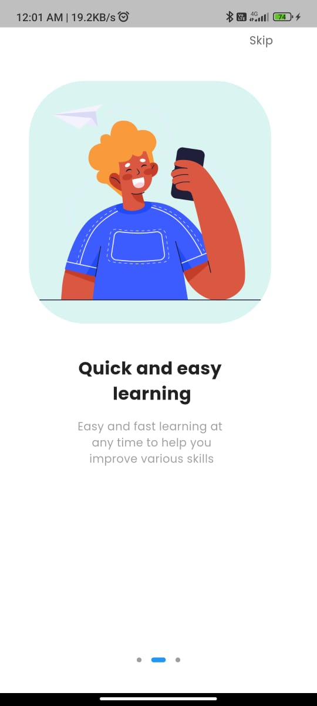
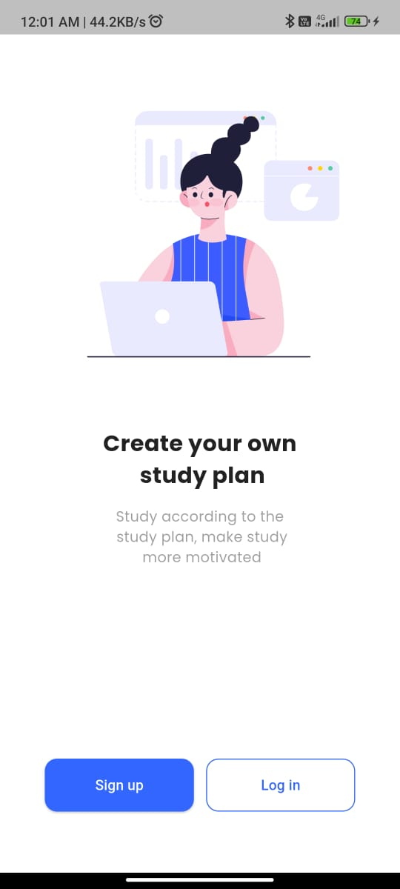
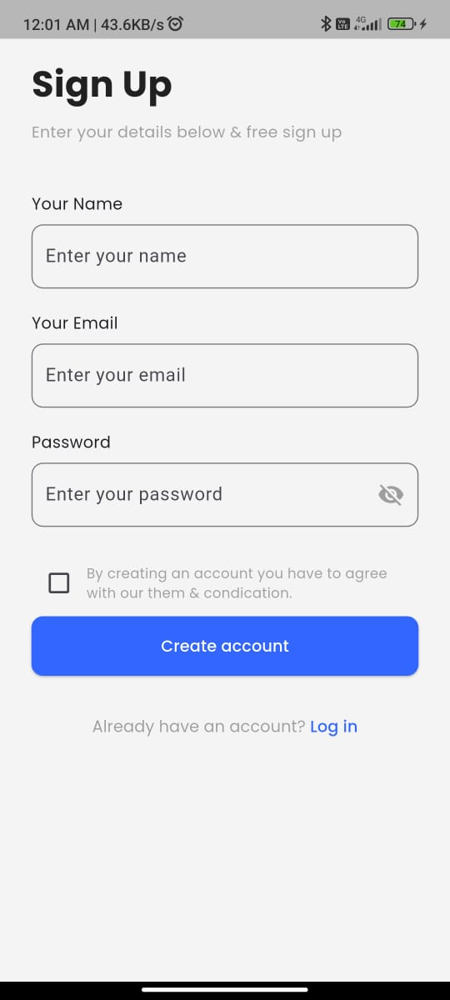

# BookApp

A Flutter app to browse, search, and view books using the Google Books API. Includes email/password and Google authentication, user profile, and category-based book browsing.

---

## Screenshots

> Replace these with your own screenshots from the app

  
  
  
  
  
  
  


---

## State Management

This app uses **GetX** for state management. GetX provides reactive variables and controllers to manage UI state and business logic efficiently.

- Controllers (e.g., `HomeController`, `AuthController`) are created with `Get.put()` and accessed via `Get.find()`.
- UI widgets use `Obx()` to listen for changes in reactive variables and update automatically.
- Example: `HomeController` manages the book list, loading state, and filter selection. `AuthController` manages authentication and user info.

---

## Assumptions & Limitations

- The app assumes the Google Books API and Firebase user model provide all required fields (title, authors, thumbnail, etc.).
- "Popular" books filtering is limited if the API/model does not provide a rating field.
- "New" books are filtered by published date if available.
- Filter and search state are not persisted across app restarts.
- Error handling is basic (snackbars for errors).
- Only one instance of each controller is used globally via GetX.

---

## Firebase Setup

This project uses **Firebase Authentication** for Email/Password and Google Sign-In.

### Steps to set up Firebase:
1. Go to [Firebase Console](https://console.firebase.google.com/).
2. Create a new Firebase project.
3. Add an Android app and/or iOS app with your project package name.
4. Download the config file:
    - **Android**: `google-services.json` → place it in `android/app/`.
    - **iOS**: `GoogleService-Info.plist` → place it in `ios/Runner/`.
5. Enable Authentication methods:
    - Email/Password
    - Google Sign-In
6. Add the Firebase SDK dependencies in `pubspec.yaml`:
   ```yaml
   dependencies:
     firebase_core: ^latest
     firebase_auth: ^latest
     google_sign_in: ^latest
7. void main() async {
   WidgetsFlutterBinding.ensureInitialized();
   await Firebase.initializeApp();
   runApp(const MyApp());
   }
8. flutter clean
   flutter pub get
   flutter run
